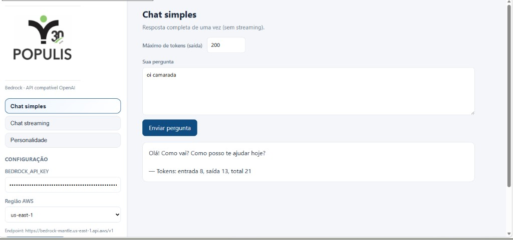

# POPULIS AI: Demo de integração Amazon Bedrock

> Demonstração técnica no modelo **BYO (Bring Your Own)**: cada cliente usa **sua conta AWS** e uma **BEDROCK_API_KEY** que ele mesmo gera no console Bedrock. A aplicação consome o endpoint compatível com OpenAI (`bedrock-mantle.<região>.api.aws/v1`). **Não há intermediação de tokens pela Populis AI** nem **cobrança de modelo pela plataforma** neste fluxo.



---

## Índice

- [Como funciona](#como-funciona)
- [Pré-requisitos](#pré-requisitos)
- [Estrutura do projeto](#estrutura-do-projeto)
- [Deploy da API (Lambda)](#deploy-da-api-lambda)
- [Deploy do frontend (S3 + CloudFront)](#deploy-do-frontend-s3--cloudfront)
- [Modelos e endpoint `/v1/chat/completions`](#modelos-e-endpoint-v1chatcompletions)
- [Modelo de custos](#modelo-de-custos)
- [Escopo da POC](#escopo-da-poc)
- [Segurança](#segurança)

---

## Como funciona

O modelo é **BYO (Bring Your Own) chave + região**:

1. O cliente gera uma **Long-term API key** no AWS Console → Bedrock → API keys.
2. Informa a **BEDROCK_API_KEY** e a **região** (onde os modelos estão habilitados) na interface.
3. O navegador chama a **Lambda** (Function URL); a Lambda encaminha ao Bedrock mantle usando a chave enviada no corpo da requisição.
4. A **AWS cobra os tokens** na conta do cliente (Cost Explorer / budgets).

O portal oferece **listagem de modelos**, **chat simples** (bolhas, uma resposta por turno), **chat com histórico** (chunks agregados) e **personalidade** (system prompt).

---

## Pré-requisitos

- Conta AWS com **Amazon Bedrock** habilitado na região desejada.
- **Long-term API key**: Console → Bedrock → API keys → Long-term API keys.
- **Python 3.10+** e `pip`.
- **Docker** (recomendado para gerar o ZIP da Lambda em Linux).
- Para **`deploy.py`** (CloudFront): **boto3** (`pip install boto3`) e permissões IAM para **S3**, **CloudFront** e criação/uso de **Origin Access Control** (OAC).

---

## Estrutura do projeto

```
portal/
├── frontend/           # UI estática (HTML/CSS/JS): chat e configuração
├── backend/             # Lambda: POST /api/models | POST /api/completion
├── deploy_aws.py        # Empacota Lambda, Function URL e opcionalmente S3 público
├── deploy.py            # Publica frontend em S3 privado + CloudFront (OAC)
├── requirements-deploy.txt
├── scripts/             # Auxiliares ZIP e sync
└── portal.png           # Screenshot para documentação
```

---

## Deploy da API (Lambda)

Na pasta `portal`:

```bash
pip install -r requirements-deploy.txt
python deploy_aws.py --region us-east-1 --use-docker --public-website --write-local-config
```

| Flag | Descrição |
|------|-----------|
| `--use-docker` | Gera `function.zip` compatível com Lambda (Linux). **Recomendado.** |
| `--skip-s3` | Atualiza só a Lambda |
| `--skip-lambda` | Só frontend/bucket (sem Lambda) |
| `--public-website` | Bucket S3 como site HTTP público (alternativa ao fluxo CloudFront) |
| `--write-local-config` | Grava `frontend/js/config.js` com a URL da Function URL |

```bash
python deploy_aws.py --help
```

---

## Deploy do frontend (S3 + CloudFront)

O script **`deploy.py`** envia `frontend/` para um bucket **privado** e serve via **CloudFront** com **Origin Access Control (OAC)**. Injeta a URL da API em `js/config.js` no upload.

```bash
pip install boto3
python deploy.py --api-url "https://xxxxxxxx.lambda-url.us-east-1.on.aws"
```

Variáveis úteis:

| Variável | Descrição |
|----------|-----------|
| `PORTAL_API_URL` | Mesmo papel que `--api-url` (sem barra final) |
| `FRONTEND_S3_BUCKET` | Bucket de destino (sobrescreve o padrão do script) |
| `AWS_REGION` | Região do bucket (ex.: `us-east-1`) |
| `FRONTEND_AWS_ACCOUNT_ID` | Se definida, o deploy falha se `sts get-caller-identity` for outra conta |
| `FORCE_RECREATE_CLOUDFRONT=true` | Recria a distribuição (por padrão ela é **reutilizada**) |

Flags principais:

| Flag | Descrição |
|------|-----------|
| `--bucket NOME` | Bucket S3 |
| `--skip-cloudfront` | Só upload ao S3; se existir `.cloudfront-config.json`, tenta invalidação |
| `--force-recreate-cloudfront` | Remove e recria a distribuição salva localmente |
| `--write-local-config` | Atualiza `frontend/js/config.js` no disco antes do upload |

Arquivos gerados na raiz de `portal/` (não versionar em repositório público sem critério): `.oac-config.json`, `.cloudfront-config.json`.

Ao final, o script indica quando está **pronto para testar**; no console CloudFront aguarde **Status = Deployed** antes de validar em produção.

---

## Modelos e endpoint `/v1/chat/completions`

A Lambda usa o cliente OpenAI contra o Bedrock mantle em **`/v1/chat/completions`**. **Nem todo modelo listado** pelo Bedrock nesse ecossistema aceita esse endpoint: ao escolher um modelo, se aparecer erro **400** do tipo *does not support '/v1/chat/completions'*, troque para outro modelo ou consulte a documentação AWS sobre modelos suportados em **chat completions** no modo compatível com OpenAI.

---

## Modelo de custos

| Quem | O quê |
|------|--------|
| **Cliente** | Tokens de IA (Bedrock), faturados na conta AWS dele |
| **Populis AI** | Plataforma / produto (custo de tokens fora do escopo deste modelo) |

**Vantagens:** custo visível e controlado pelo cliente; budgets e limites AWS próprios; isolamento por conta.

---

## Escopo da POC

**Incluso nesta POC:**

- Modelo BYO chave + região.
- Demo web (front estático + API Lambda) com os fluxos principais do Bedrock.
- Apoio ao cliente na geração da chave no console (orientação).

**Fora do escopo da POC:**

- Cadastro persistente de chaves na plataforma Populis AI.
- Criptografia e validação formal de credenciais em produto.
- Status de integração e tutorial embutido em produção.

> Itens fora do escopo exigem **Change Request** apartada (prazo e custo próprios).

---

## Segurança

A **Long-term API key** é credencial sensível:

- **Não compartilhe** fora do canal acordado com a Populis AI.
- Configure **expiração** e **rotação** no console AWS (Bedrock → API keys).
- **AWS Budgets / alertas de gasto:** no modelo **BYO**, a fatura do Bedrock cai na **conta AWS do cliente**. Orçamentos e alertas (**Billing**, Cost Management, SNS etc.) devem ser criados **nessa conta** por quem tem permissão de billing. A Populis AI não configura isso por padrão; apoio só com acordo ou acesso que o cliente conceder.

Infra deste demo:

- Bucket do frontend atrás do CloudFront fica **sem acesso público direto ao S3**; o usuário acessa o site por **HTTPS** na distribuição.
